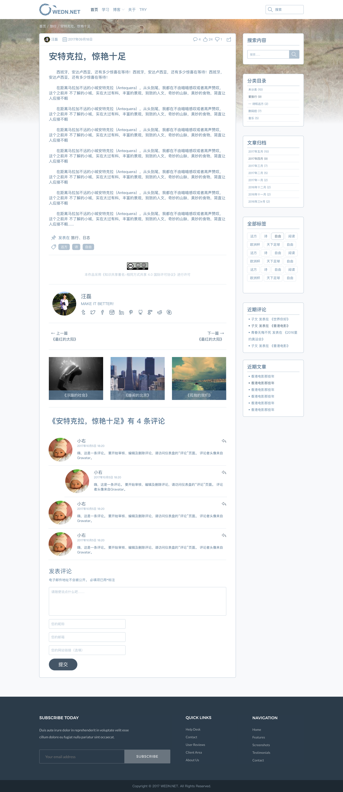

# Reborn

[![Build Status][travis-image]][travis-url]
[![Dependency Status][dependency-image]][dependency-url]
[![devDependency Status][devdependency-image]][devdependency-url]
[![Code Style][style-image]][style-url]

[travis-image]: https://img.shields.io/travis/zce/reborn.svg
[travis-url]: https://travis-ci.org/zce/reborn
[dependency-image]: https://img.shields.io/david/zce/reborn.svg
[dependency-url]: https://david-dm.org/zce/reborn
[devdependency-image]: https://img.shields.io/david/dev/zce/reborn.svg
[devdependency-url]: https://david-dm.org/zce/reborn?type=dev
[style-image]: https://img.shields.io/badge/code%20style-standard-brightgreen.svg
[style-url]: http://standardjs.com/

> wedn.net site pages

## Preview

## TODOS

- [ ] header media height

<!--
  https://github.com/yeoman/generator-webapp/compare/2a6113f3e6c8e67a0f48d2bb96e4570a20143877...master
  https://github.com/twbs/bootstrap/compare/8396039b4e2ca10ef06ee21b8c02288c2b01db07...v4-dev
-->
